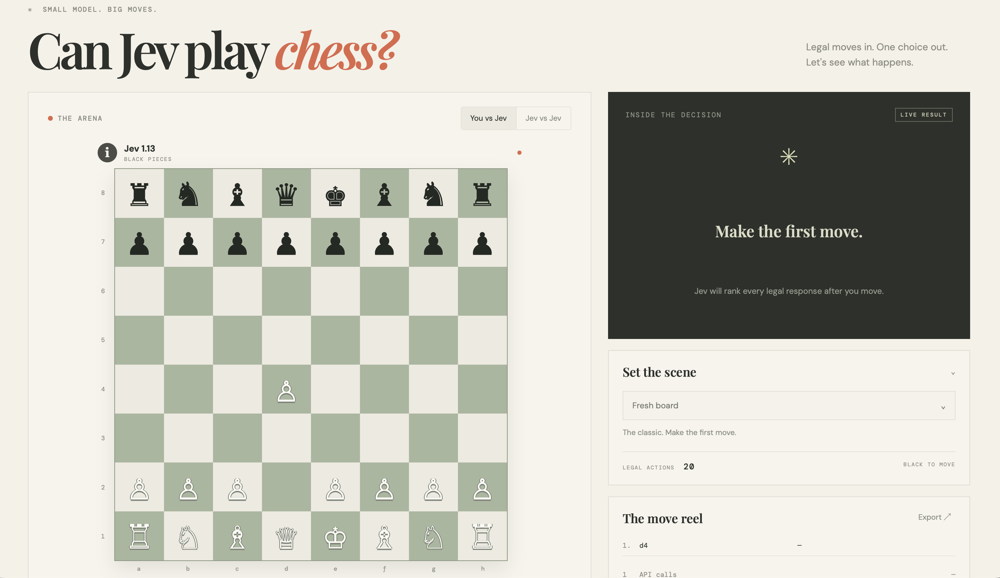

# Jev Plays Chess

A browser chess lab where you play White against Jev 1.13 Free through OpenCode Zen. Games stay on the device in SQLite persisted through IndexedDB.



## Stack

- React + TypeScript + Vite
- `chess.js` for legal moves, check, checkmate, and PGN
- `sql.js` for browser-side SQLite
- Web Crypto AES-GCM for encrypting the saved Jev API key
- Cloudflare Worker + Wrangler for the same-origin Jev proxy and static deployment

## Requirements

- Node.js 20+
- npm
- A Cloudflare account for deployment
- An OpenCode API key with access to `jev-1.13-free`

## Local development

Install dependencies:

```bash
npm install
```

Start the Vite app:

```bash
npm run dev
```

Open the local URL printed by Vite. The Vite development server proxies `/api/jev` to OpenCode so the browser does not hit the upstream CORS restriction directly.

The first visit asks for an OpenCode API key. It is encrypted before being written into the local SQLite database. The database and encryption key are browser-local; clearing site data removes them.

## Cloudflare deployment

Authenticate Wrangler once:

```bash
npx wrangler login
npx wrangler whoami
```

Build and deploy the Worker plus the Vite assets:

```bash
npm run deploy
```

The Worker handles `/api/jev` and forwards the request to:

```text
https://opencode.ai/zen/v1/systemone
```

All other requests are served from the built `dist/` assets. `wrangler.jsonc` contains the Worker name, entry point, compatibility date, and static asset binding.

To run the built Worker locally instead of Vite:

```bash
npm run cf:dev
```

This builds the app first, then starts Wrangler's local Worker runtime.

## Scripts

| Command | Purpose |
| --- | --- |
| `npm run dev` | Start Vite development mode with the Jev proxy |
| `npm run build` | Type-check and create the production bundle |
| `npm run preview` | Preview the Vite production bundle locally |
| `npm run cf:dev` | Build and run the Cloudflare Worker locally |
| `npm run deploy` | Build and deploy to Cloudflare |

## How a move works

1. `chess.js` validates the move and updates the local position.
2. The app sends the FEN, PGN, and all currently legal moves to `/api/jev`.
3. The Worker forwards the request to OpenCode Zen using the browser-provided API key.
4. Jev returns a structured Choice answer containing a selected move, probabilities, and confidence.
5. The app validates Jev's selected UCI move before applying it.
6. The current game and Jev's decision data are saved locally.

Jev is a structured decision model, not a traditional chess engine. The app gives it only legal moves to choose from, so the browser remains responsible for chess rules.

## Data and security

Games never leave the browser unless their position is sent to Jev for the current move. The SQLite database is serialized into IndexedDB because browsers do not expose a general-purpose SQLite file API directly.

The API key is encrypted with a non-extractable AES-GCM Web Crypto key. This protects against plaintext storage, but it is not a complete security boundary: code running in the same origin, a malicious browser extension, or compromised device could still use the decrypted key when making a move. Do not use a valuable production credential in an untrusted deployment.

The Cloudflare Worker does not store the key. It forwards the `Authorization` header for the individual request and does not log request bodies.

## Project layout

```text
src/
  App.tsx             Main chess UI and game flow
  styles.css          Visual design and responsive layout
  lib/chess.ts        Board helpers and piece rendering data
  lib/jev.ts          Direct Jev request and response parsing
  lib/storage.ts      SQLite persistence and Web Crypto key storage
  main.tsx            React entry point
worker/
  index.ts            Same-origin Cloudflare proxy for `/api/jev`
wrangler.jsonc        Cloudflare Worker and asset configuration
vite.config.ts        Vite dev server and local Jev proxy
```

## Troubleshooting

### CORS error in local development

Use `npm run dev`, not a static file server. Vite owns the `/api/jev` development proxy.

### Wrangler authentication failed

Run `npx wrangler login` again, then confirm with `npx wrangler whoami` before running `npm run deploy`.

### Jev returns `401`

Open **Under the hood** in the app and replace the saved OpenCode API key.

### A saved game disappeared

Games are browser-local. Clearing site data, using a different browser profile, or changing the hostname creates a separate database.
